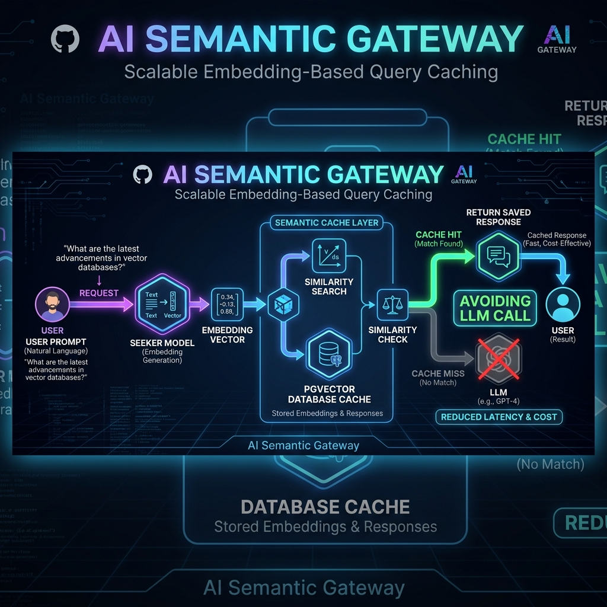

# AI Semantic Gateway



A production-ready semantic caching gateway for Large Language Models (LLMs). Instead of matching cached prompts by exact string equivalence, the gateway translates prompts into dense vector embeddings, performs nearest-neighbor search using cosine distance via **PostgreSQL (pgvector)**, and returns cached responses for semantically equivalent queries.

---

## Why a Semantic Cache?

For applications handling conversational query loads, users frequently ask paraphrased versions of the identical request:
* *"How do I reset my password?"*
* *"How can I change my account password?"*
* *"Where do I go to change my login password?"*

Traditional exact-match caching (like Redis key-value stores) misses these variations, resulting in redundant, expensive API calls to upstream providers (like OpenAI). By matching prompts in vector space, this gateway intercepts similar requests, serving them in **~1.2 seconds** from a database lookup rather than **~3-5 seconds** of LLM generation, saving over **80%+ on API spend** for redundant traffic.

---

## 🏗️ System Architecture

```
                                      ┌────────────────────────────────┐
                                      │            Vercel              │
                                      │   React + Vite Frontend UI     │
                                      └────────────────┬───────────────┘
                                                       │
                                                       │ HTTPS (REST API)
                                                       ▼
                                      ┌────────────────────────────────┐
                                      │            Render              │
                                      │   Spring Boot Caching Engine   │
                                      └───────┬────────────────┬───────┘
                                              │                │
                        JDBC (Connection Pool)│                │ HTTPS (API)
                                              ▼                ▼
┌──────────────────────────────────────────────┐      ┌────────────────┐
│                   Supabase                   │      │     OpenAI     │
│  PostgreSQL + pgvector Database Instance     │      │  completions & │
│                                              │      │   embeddings   │
└──────────────────────────────────────────────┘      └────────────────┘
```

The gateway is built on a modern, decoupled stack:
* **Frontend:** React, TypeScript, Tailwind CSS, Vite. Deployed on **Vercel**.
* **Backend:** Spring Boot (Java 21), Hibernate/JPA, HikariCP, WebClient. Deployed on **Render**.
* **Database:** PostgreSQL on **Supabase** with the **pgvector** extension enabled for vector similarity lookups.

---

## 💾 Database Schema

The database model is defined across three core tables in PostgreSQL:

### 1. `semantic_cache`
Stores past queries, their responses, and their vector representation.
```sql
CREATE TABLE semantic_cache (
    id BIGSERIAL PRIMARY KEY,
    prompt TEXT NOT NULL,
    response TEXT NOT NULL,
    embedding vector(1536)  -- pgvector column for OpenAI text-embedding-3-small
);

-- Cosine distance index for fast nearest-neighbor search
CREATE INDEX semantic_cache_embedding_idx 
ON semantic_cache USING ivfflat (embedding vector_cosine_ops) WITH (lists = 100);
```

### 2. `request_log`
Tracks the telemetry of all incoming requests to power real-time analytics.
```sql
CREATE TABLE request_log (
    id BIGSERIAL PRIMARY KEY,
    prompt TEXT NOT NULL,
    response TEXT NOT NULL,
    timestamp TIMESTAMPTZ NOT NULL,
    source VARCHAR(10) NOT NULL,            -- 'cache' (hit) or 'llm' (miss)
    similarity DOUBLE PRECISION,            -- Cosine similarity score
    duration_ms BIGINT NOT NULL,            -- Response latency in milliseconds
    estimated_cost_saved DOUBLE PRECISION   -- USD saved if cached ($0.0004/call)
);
```

### 3. `system_settings`
Manages the real-time configuration of the gateway.
```sql
CREATE TABLE system_settings (
    id BIGSERIAL PRIMARY KEY,
    similarity_threshold DOUBLE PRECISION NOT NULL DEFAULT 0.90, -- Cosine similarity cutoff
    max_prompt_length INT NOT NULL DEFAULT 8000,                  -- Max input length
    mock_mode BOOLEAN NOT NULL DEFAULT false                      -- Toggle local mock AI mode
);
```

---

## 🔄 Detailed Query Flow & Caching Logic

```
   [Incoming Prompt]
           │
           ▼
[Generate Prompt Embedding]  ──► (OpenAI text-embedding-3-small or mock vector)
           │
           ▼
[Query Database for Matches] ──► (Find top match using Cosine Distance <=> in SQL)
           │
           ▼
 [Cosine Similarity Score]
           │
           ├─► Score ≥ Threshold ──► [Cache Hit] ──► Return Cached Response
           │
           └─► Score < Threshold ──► [Cache Miss] ──► Call Upstream LLM (OpenAI)
                                                           │
                                                           ▼
                                                    [Save to Cache]
                                             (Store prompt, response, embedding)
                                                           │
                                                           ▼
                                                    Return Response
```

1. **Embedding Generation:** When a query arrives, the gateway generates a 1536-dimensional vector embedding of the prompt (using OpenAI's `text-embedding-3-small` or a local deterministic character-histogram algorithm in mock mode).
2. **Nearest-Neighbor Query:** The gateway executes a native query using pgvector's cosine distance operator (`<=>`):
   ```sql
   SELECT id, prompt, response, (1 - (embedding <=> :queryVector)) AS similarity
   FROM semantic_cache
   ORDER BY embedding <=> :queryVector
   LIMIT 1;
   ```
3. **Threshold Valuation:**
   * **Cache Hit:** If the cosine similarity score is greater than or equal to the configured `similarity_threshold` (e.g., `0.80`), the gateway serves the cached `response` immediately. An audit log is saved with `source = 'cache'`.
   * **Cache Miss:** If the similarity is lower than the threshold, the gateway executes a chat completion request to OpenAI (`gpt-4o-mini`). The prompt, completion response, and vector embedding are committed to the `semantic_cache` table, and an audit log is saved with `source = 'llm'`.

---

## 🔌 API Reference

### 1. Query Endpoint
* **Endpoint:** `POST /api/v1/query`
* **Request Body:**
  ```json
  {
    "prompt": "How do I reset my password?"
  }
  ```
* **Response Body:**
  ```json
  {
    "status": 200,
    "data": {
      "response": "To reset your password, click Forgot Password on the login screen...",
      "source": "cache",
      "similarity": 1.0,
      "durationMs": 12
    },
    "timestamp": "2026-07-05T06:00:00Z"
  }
  ```

### 2. Stats Endpoint
* **Endpoint:** `GET /api/v1/stats`
* **Response Body:**
  ```json
  {
    "requestCount": 142,
    "cacheHits": 64,
    "cacheMisses": 78,
    "hitRate": 0.4507,
    "estimatedCostSavedUsd": 0.0256,
    "uptimeSeconds": 86400
  }
  ```

### 3. Analytics Endpoints
* **Requests Per Hour:** `GET /api/v1/analytics/requests-per-hour`
  * Returns traffic volumes aggregated by hour for the past 24 hours.
* **Latency Percentiles:** `GET /api/v1/analytics/latency`
  * Returns daily latency statistics containing p50, p95, and p99 metrics.
* **Top Cached Prompts:** `GET /api/v1/analytics/top-prompts`
  * Returns the most frequently triggered prompts in the cache.

---

## 🚀 Running the Project Locally

For step-by-step instructions on setting up the codebase, starting the frontend/backend servers, and database configurations, please refer to:

👉 **[RUN_LOCALLY.md](file:///Users/abhijeet/Desktop/ai-semantic-gateway/RUN_LOCALLY.md)**
